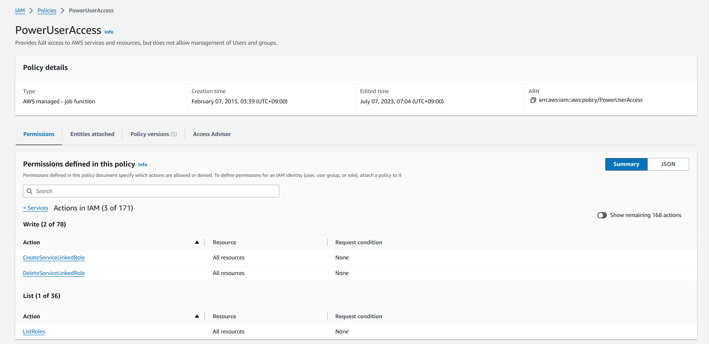

# 課題02

## ユーザー

### 管理者権限ユーザーの作成


### ルートではなく管理者権限を持つユーザーか

- IAMユーザーを使用すると、最小限の必要な権限を与えることができる。
- ルートユーザーは、AWSアカウントに対して全ての権限を持つため、セキュリティ上のリスクが高い。
- IAMユーザーごとにアクセスログが記録されるため、誰が何を行ったかを追跡することができる。  

### ひとつのユーザーを使い回す問題

- 誰が何を行ったかを追跡することができない。  
- ID/パスワードを知っているユーザーが退職した場合、そのID/パスワードを使用して不正アクセスされるリスクがある。  

### PowerUserAccessのIAMユーザーの作成


### 表示されるエラーメッセージ


- 理由

PowerUserAccessにはIAMに関しての権限があるが、　　
ダッシュボードに表示される内容についてアクセス権限がないため、エラーメッセージが表示される。  



### AdministratorAccessとPowerUserAccessの違い

IAM, Organizations, Accountに関する権限があるかどうか。  

- AdministratorAccess

```json
{
    "Version": "2012-10-17",
    "Statement": [
        {
            "Effect": "Allow",
            "Action": "*",
            "Resource": "*"
        }
    ]
}
```

- PowerUserAccess

```json
{
    "Version": "2012-10-17",
    "Statement": [
        {
            "Effect": "Allow",
            "NotAction": [
                "iam:*",
                "organizations:*",
                "account:*"
            ],
            "Resource": "*"
        },
        {
            "Effect": "Allow",
            "Action": [
                "iam:CreateServiceLinkedRole",
                "iam:DeleteServiceLinkedRole",
                "iam:ListRoles",
                "organizations:DescribeOrganization",
                "account:ListRegions",
                "account:GetAccountInformation"
            ],
            "Resource": "*"
        }
    ]
}
```

- 参考
  - [AWS PowerUserとAdministratorの違い](https://tugurur.com/aws-poweruser-administrator/)

### AWS管理ポリシーとカスタマー管理ポリシーの使い分け

特定のサービスやリソースのアクセス権限を一元管理する場合、AWS管理ポリシー。  
特定のリソースに対する細かいアクセス制御が必要な場合や、  
企業のセキュリティポリシーに基づいて独自のルールを設定する場合、カスタマー管理ポリシー。  

## グループ

### グループを作成してユーザーを追加する

- Administratorsグループを作成し、ユーザーを追加


- AdministratorsグループにAdministratorAccessポリシーをアタッチ


- Administratorsグループに所属するユーザーでログイン


### ポリシーの付与とグループへの所属

グループに付与してユーザを所属させる。  
AdministratorAccessポリシーはとても強い権限のため、誰がこの権限を持っているかを把握したい。  
個別にユーザーにアタッチすると誰がこの権限を持っているかを把握しにくい。
グループにアタッチしてユーザーを所属させることで誰がこの権限を持っているかを把握しやすくなる。  

## サービスのIAM

- S3にアクセスするためのIAMロールを作成  


- EC2インスタンスを作成


- S3バケットを作成


- EC2インスタンス上でS3バケットにアクセス

```sh
aws s3 ls s3://test-bucket0506
```


- 特定のS3バケットのみにアクセス権を付与する場合

```json
{
    "Version": "2012-10-17",
    "Statement": [
        {
            "Effect": "Allow",
            "Action": [
                "s3:ListBucket"
            ],
            "Resource": [
                "arn:aws:s3:::test-bucket0506"
            ]
        },
        {
            "Effect": "Allow",
            "Action": [
                "s3:GetObject"
            ],
            "Resource": [
                "arn:aws:s3:::test-bucket0506/*"
            ]
        }
    ]
}
```


### インスタンスにロールを付与するか、ポリシーを付与するか

ロールを付与する。  
スケーリングなどで複数インスタンスに同じ権限を付与する場合、ロールを付与することで一元管理ができる。  

### Resource basedとIdentity basedの違い

- Identity based
  - IAMユーザー、グループ、ロールにアタッチされるポリシー
  - 特定のユーザーやグループのアクセスを制御したい場合に使用する。
- Resource based
  - S3バケット、SNSトピック、SQSキューなど、AWSのリソースに対してアタッチされるポリシー
  - リソース自体が誰にアクセスを許可するかを決定するため、  
    AWS のリソースに対するアクセスをより広範囲に制御したい場合に使用する。

- 参考
  - [アイデンティティベースおよびリソースベースのポリシー](https://docs.aws.amazon.com/ja_jp/IAM/latest/UserGuide/access_policies_identity-vs-resource.html)

### S3に設定した方が良い項目

Block public access  
S3バケットポリシーでパブリックアクセスを禁止する設定を行う。  

## 設計方針

### ホワイトリスト方式

- メリット
- デメリット
- サービス例

### ブラックリスト方式

- メリット
- デメリット
- サービス例

### 自動チェック
