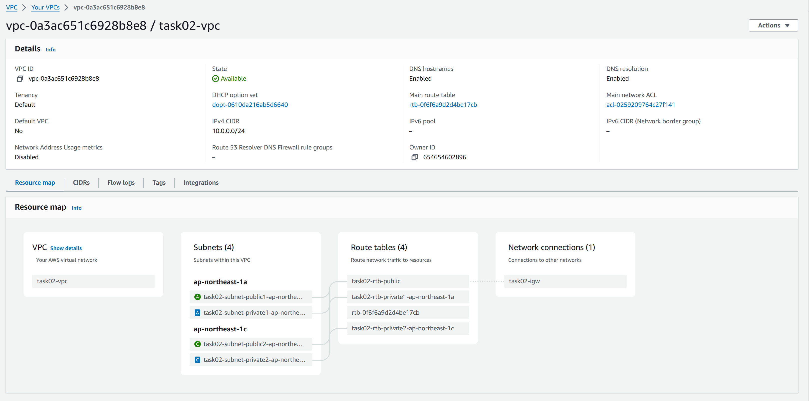
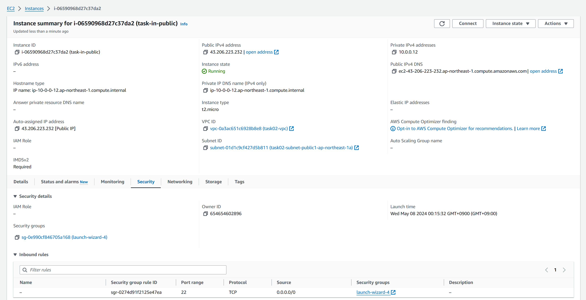
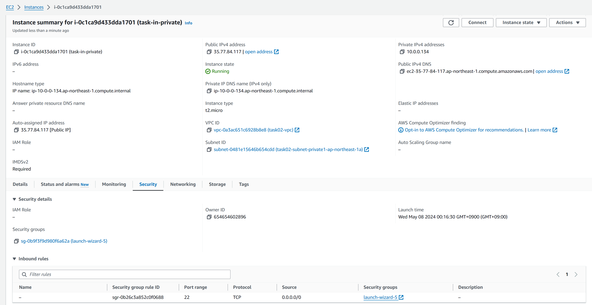

# 課題01

## 質問

### プライベートサブネットとパブリックサブネットの違い

- プライベートサブネット
  - インターネットゲートウェイを直接介してインターネットに接続できないサブネット
  - NATゲートウェイを介してインターネットに接続することができる
  - データベースサーバーなど、インターネットから直接アクセスされることを望まないリソースをホストするのに適している
- パブリックサブネット
  - インターネットゲートウェイを介してインターネットに接続できるサブネット
  - ウェブサーバーなど、インターネットから直接アクセス可能なリソースをホストするのに適しています

### プライベートサブネットとパブリックサブネットを構築



### パブリックサブネットにEC2インスタンス



```sh
ssh -i .\TestAccess.pem ec2-user@43.206.223.232
```

```sh
   ,     #_
   ~\_  ####_        Amazon Linux 2023
  ~~  \_#####\
  ~~     \###|
  ~~       \#/ ___   https://aws.amazon.com/linux/amazon-linux-2023
   ~~       V~' '->
    ~~~         /
      ~~._.   _/
         _/ _/
       _/m/'
Last login: Tue May  7 15:26:24 2024 from 126.114.249.232
```

### プライベートサブネットにEC2インスタンス



- ローカルPCからSSH

```sh
 ssh -i .\TestAccess.pem ec2-user@35.77.84.117
```

```sh
ssh: connect to host 35.77.84.117 port 22: Connection timed out
```

- パブリックサブネットにあるEC2インスタンスからプライベートサブネットにあるEC2インスタンスにSSH

```sh
chmod 400 TestAccess.pem
ssh -i TestAccess.pem ec2-user@ec2-35-77-84-117.ap-northeast-1.compute.amazonaws.com
```

```sh
   ,     #_
   ~\_  ####_        Amazon Linux 2023
  ~~  \_#####\
  ~~     \###|
  ~~       \#/ ___   https://aws.amazon.com/linux/amazon-linux-2023
   ~~       V~' '->
    ~~~         /
      ~~._.   _/
         _/ _/
       _/m/'
```
