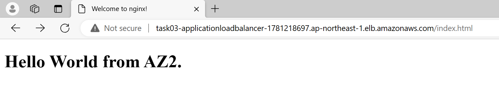

# 課題01

## 内容

### EC2インスタンスを構築


### Nginxを導入

#### 事前準備

1. パブリックサブネットにNATゲートウェイを設置
1. プライベートサブネットのルートテーブルにてデフォルトゲートウェイをNATゲートウェイを設定

#### Nginxのインストール

```sh
sudo dnf install -y nginx
```

インストールの確認

```sh
nginx -v

# result
nginx version: nginx/1.24.0
```

Nginxの起動

```sh
sudo systemctl start nginx
```

Nginxの起動確認

```sh
curl localhost

# result
<!DOCTYPE html>
<html>
<head>
<title>Welcome to nginx!</title>
<style>
html { color-scheme: light dark; }
body { width: 35em; margin: 0 auto;
font-family: Tahoma, Verdana, Arial, sans-serif; }
</style>
</head>
<body>
<h1>Welcome to nginx!</h1>
<p>If you see this page, the nginx web server is successfully installed and
working. Further configuration is required.</p>

<p>For online documentation and support please refer to
<a href="http://nginx.org/">nginx.org</a>.<br/>
Commercial support is available at
<a href="http://nginx.com/">nginx.com</a>.</p>

<p><em>Thank you for using nginx.</em></p>
</body>
</html>
```

#### index.htmlを編集

```sh
cd  /usr/share/nginx/html
sudo vi index.html
```

AZのところは適宜変更

```html
<!DOCTYPE html>
<html>
<head>
<title>Welcome to nginx!</title>
</head>
<body>
<h1>Hello World from AZ1.</h1>
</body>
</html>
```

Nginxを再起動し、ページの内容を確認

```sh
sudo nginx -s reload
curl localhost

# result
<!DOCTYPE html>
<html>
<head>
<title>Welcome to nginx!</title>
</head>
<body>
<h1>Hello World from AZ1.</h1>
</body>
</html>
```

### ALBを設置

- Target Groupの作成  
Private subnetの2台のEC2インスタンスをターゲットに設定  


- Application Load Balancerの作成  


- ALBのSecurity Groupにインバウンドルールを追加  


- 参考
  - [Application Load Balancerを経由してAmazon EC2上のWebページにアクセスする設定をまとめてみた](https://dev.classmethod.jp/articles/access-apache-page-via-alb/)

### ALBのAレコードからアクセス




### 片方のEC2インスタンスを停止


- TargetGroup


- AZ1のみになる  

