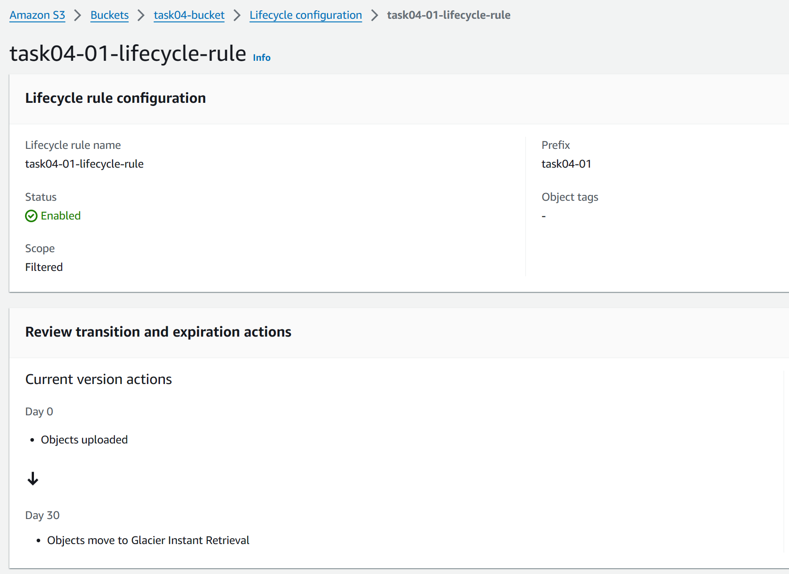
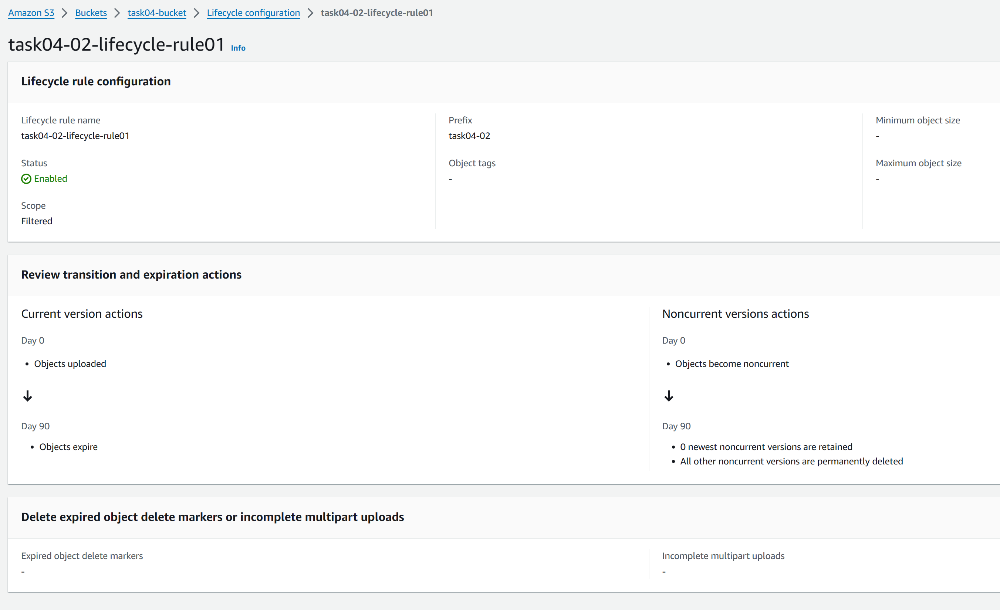
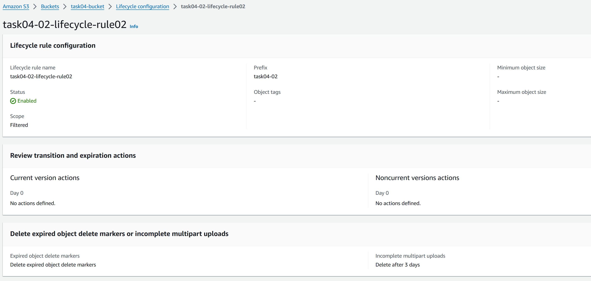

# 課題01

## ストレージクラス

### ストレージクラスの種類

- S3 Standard  
  - 高い可用性、耐久性、パフォーマンスを持つストレージクラス
  - Webアプリケーション、コンテンツ配信など幅広いユースケースに適している
- S3 Standard-IA  
  - S3 Standardよりも低い料金で提供されるストレージクラス
  - データがアクセスされる頻度が低いデータ、  
    長期保存、バックアップ、災害対策ファイルなどに適している
- S3 Intelligent-Tiering  
  - データのアクセスパターンに応じて自動的に適切なストレージクラスに移動するストレージクラス
  - アクセス頻度が予測できない場合に適している
- S3 One Zone-IA  
  - 1つのアベイラビリティーゾーンにデータを保存するストレージクラス(他は3AZ以上)
  - ログや再作成可能なデータなど、アクセス頻度が低く、耐障害性が低くても構わないデータに適している
- S3 Glacier Instant Retrieval  
  - アクセスはほとんどないが、即時取り出しが必要な長期間保存データに適している
- S3 Glacier Flexible Retrieval  
  - アクセスがほとんどなく、長期間保存データに適している
  - 必要に応じて取り出し方法を柔軟に選択できる  
    無料で取り出し可能な場合もある
- S3 Glacier Deep Archive  
  - アクセスがほとんどなく、取り出しに時間がかかる長期間保存データに適している
  - すべてのストレージクラスの中で最も低額

- 参考
  - [Amazon S3 ストレージクラスを使用する](https://docs.aws.amazon.com/ja_jp/AmazonS3/latest/userguide/storage-class-intro.html#sc-compare)
  - [S3 ストレージクラスの選択に迷った時みるチャートを作ってみた（2023年度版）](https://dev.classmethod.jp/articles/should_i_choice_s3_storage_class_2023/)

### ほとんどアクセスされないバケット

- S3 Glacier Instant Retrieval
- S3 Glacier Flexible Retrieval
- S3 Glacier Deep Archive

いづれもアクセス頻度が低いデータに適しており、  
取り出しに時間によってどのバケットを選択するか検討する。  

## ライフサイクル

### ライフサイクルとは

ライフサイクルとは、データの保存期間やアクセス頻度に応じて、  
データを適切なストレージクラスに移動したり、削除する機能のこと

### 30日たったらS3 Glacierに移動

### 90日たったら削除

- 参考
  - [S3ライフサイクルルールの動きを理解してみた](https://dev.classmethod.jp/articles/understand-how-the-s3-lifecycle-rules-work/)
  - [良さそうなライフサイクルルール設定を考えてみた（いろいろ注意点あり）](https://techblog.asia-quest.jp/202312/ive-been-trying-to-figure-out-a-lifecycle-rule-setting-that-looks-good)
