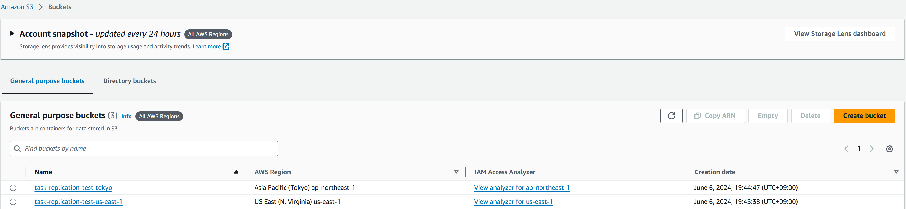
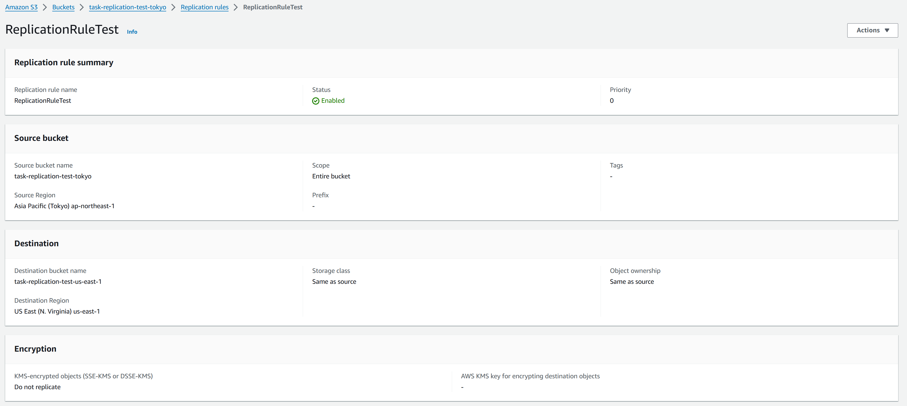
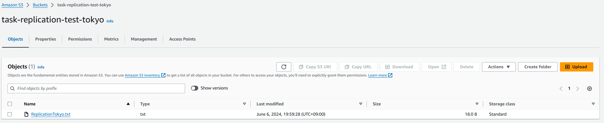
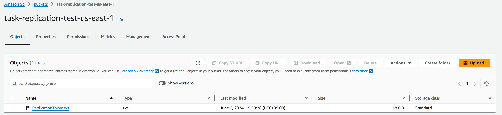
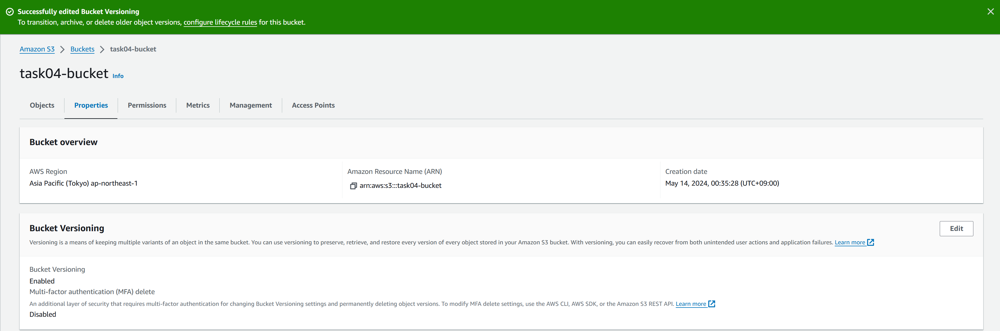
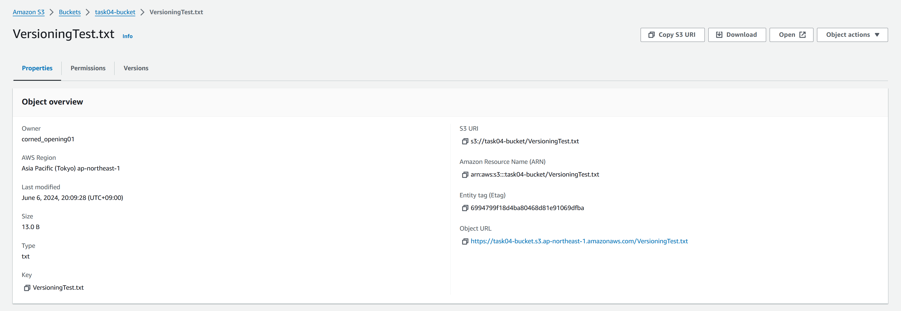
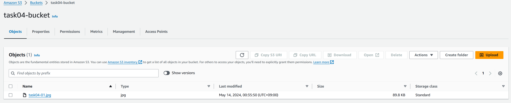
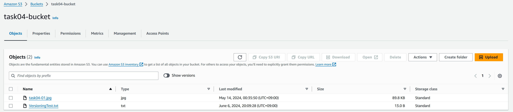

# 課題02

## バックアップ

### バージョニングとレプリケーション

- バージョニング  
オブジェクトの複数バージョンを保存する機能。  
誤って削除または上書きされたオブジェクトを復元することができる。  

- レプリケーション  
オブジェクトをバケット間で複製する機能。  
データの冗長性を高め、災害やデータ損失に備えることができる。  
ユーザーに近いリージョンにレプリケートすることで、アクセスレイテンシーを低減することも可能。  

- 違い  
バージョニングは、誤って削除や上書きされたデータを復元するための機能で、
同じバケット内でオブジェクトの複数のバージョンを保存する。  
レプリケーションはデータの冗長性や災害対策を実現するための機能で、異なるバケット間でオブジェクトを保存する。

- 参考  
  - [S3 バージョニングの仕組み](https://docs.aws.amazon.com/ja_jp/AmazonS3/latest/userguide/versioning-workflows.html)
  - [オブジェクトのレプリケーション](https://docs.aws.amazon.com/ja_jp/AmazonS3/latest/userguide/replication.html)

### レプリケーション

- レプリケーションを設定する

  - バケットを作成  

  - レプリケーションを設定  

- レプリケーション元にオブジェクトをアップロード
  - レプリケーション元  

  - レプリケーション先  

- 参考
  - [Amazon S3のレプリケーション機能を使用してみました。](https://dev.classmethod.jp/articles/lim-s3-replication/)

### バージョニング

- バージョニングを有効化  

- オブジェクトをアップロード  

- オブジェクトを削除

- オブジェクトを復元

