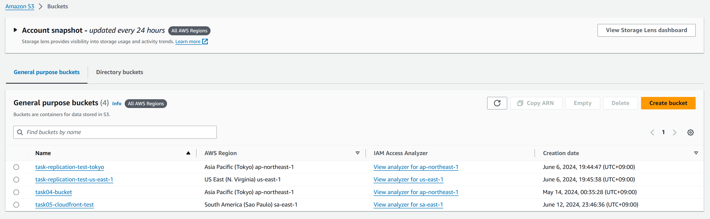
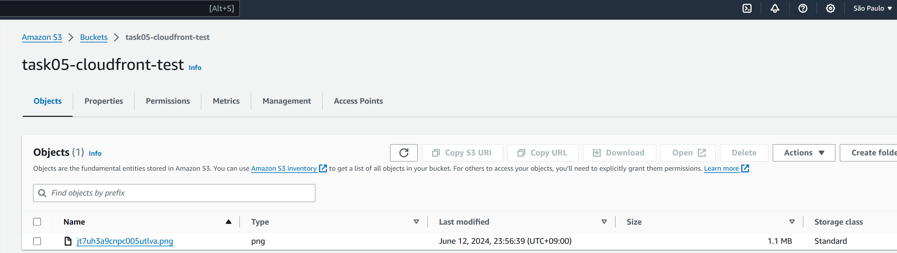
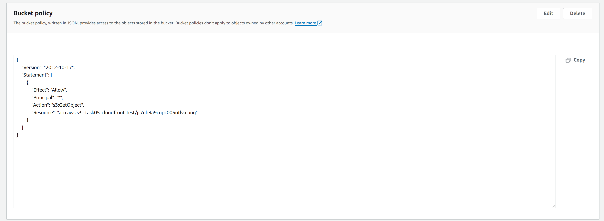
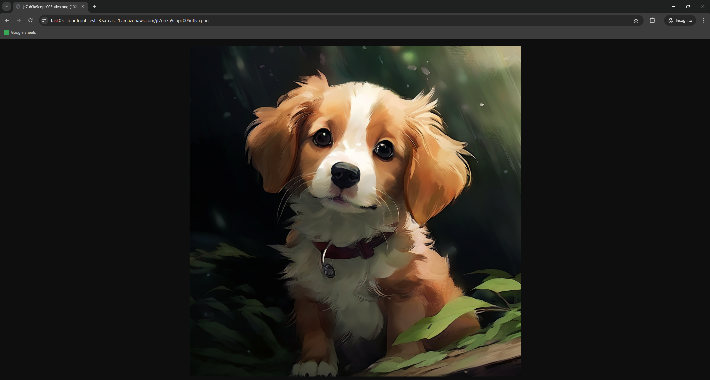
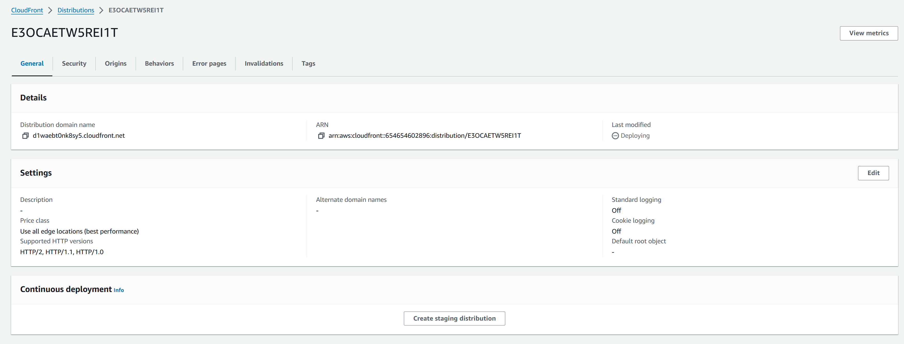
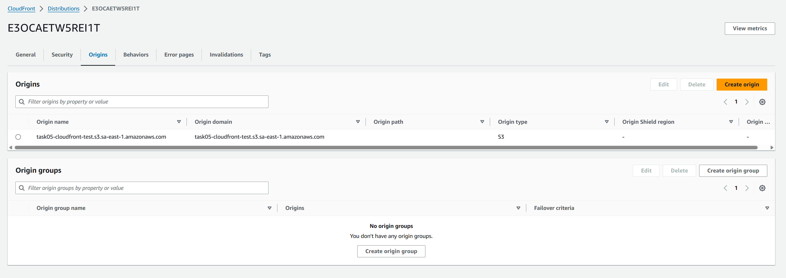
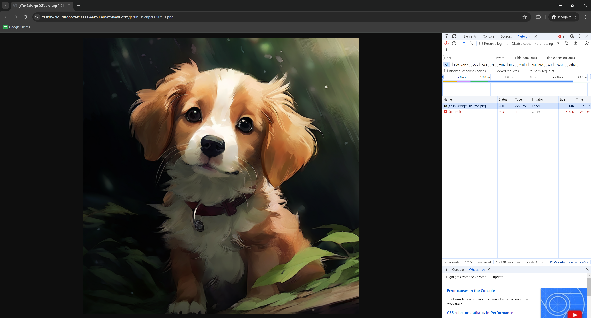
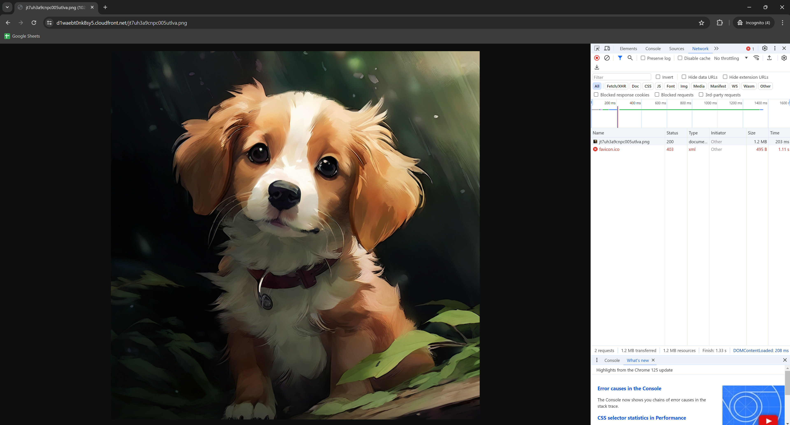

# 課題02

## 実装

### 遠いリージョンのS3に保存

南アメリカ（サンパウロ）リージョンにS3バケットを作成し、画像をアップロードする。  





### S3のURLでアクセス

Bucket policyを設定して、外部からのアクセスを許可する。  

```json
{
    "Version": "2012-10-17",
    "Statement": [
        {
            "Effect": "Allow",
            "Principal": "*",
            "Action": "s3:GetObject",
            "Resource": "arn:aws:s3:::task05-cloudfront-test/jt7uh3a9cnpc005utlva.png"
        }
    ]
}
```



<https://task05-cloudfront-test.s3.sa-east-1.amazonaws.com/jt7uh3a9cnpc005utlva.png>



### CloudFrontを設定





### CloudFrontのURLでアクセス

<https://d1waebt0nk8sy5.cloudfront.net/jt7uh3a9cnpc005utlva.png>


### S3とCloudFrontでリクエスト/レスポンス時間を確認

- S3  
  - Chrome: 2.69s  

  - Firefox: 4.456s


- CloudFront  
  - Chrome: 203ms  

  - Firefox: 157ms

