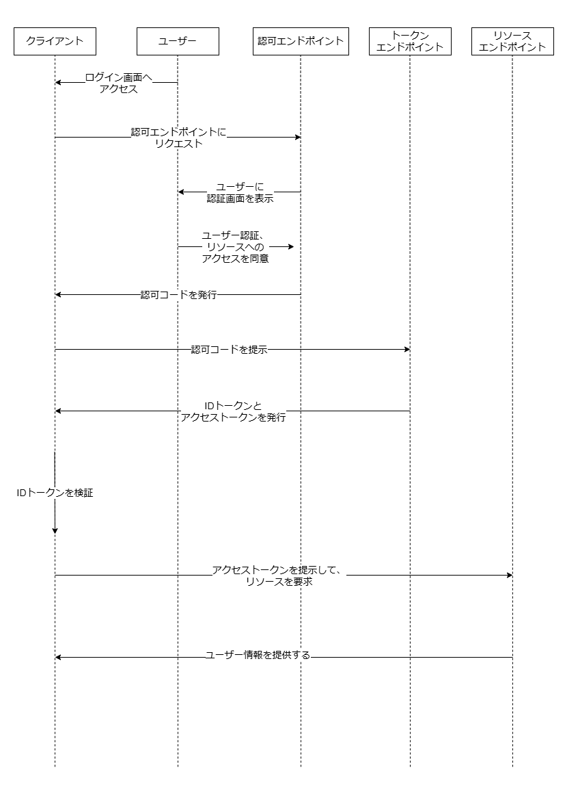

# 課題01

## 質問

### 認証と認可、全般

#### 違い

- 認証 (Authentication)  
  利用者が誰であるかを特定し、確認すること  
  例えば、ユーザーが正しいパスワードを入力しているかどうかを確認すること
  - 方法  
    - パスワード
    - トークン
    - 生体認証
- 認可 (Authorization)  
  利用者が特定のリソースや情報にアクセスする権限を持っているかどうかを確認すること  
  認証の後に行われる。  
  例えば、ユーザーが管理者権限を持っているかどうかを確認すること
  - 方法  
    - Role-Based Access Control (RBAC)  
      ユーザーにロールを割り当て、そのロールに基づいてアクセス権を決定する。
    - Attribute-Based Access Control (ABAC)  
      ユーザーの属性に基づいてアクセス権を決定する。  
    - Policy-Based Access Control (PBAC)  
      ポリシーに基づいてアクセス権を決定する。

- 参考
  - [Microsoft Authentication vs. authorization](https://learn.microsoft.com/en-us/entra/identity-platform/authentication-vs-authorization)
  - [Okta Authentication vs. Authorization](https://www.okta.com/identity-101/authentication-vs-authorization/)

#### 認証の仕組みではない

OAuth2.0は認証ではなく、認可の仕組みであるため。  

OAuth2.0はウェブサイトやアプリケーションが、  
ユーザーの代わりにリソースにアクセスするための権限を取得するためのフレームワークである。  

- 参考
  - [OAuth 2.0とは？](https://auth0.com/jp/intro-to-iam/what-is-oauth-2)

### OAuth2.0

#### Authorization grant types

- Authorization Code  
  認可サーバーを用いて、認可コード, アクセストークンを発行しリソースにアクセスする。  
  最もセキュアなグラントタイプで、主にサーバーサイドアプリケーションで使用される。  
  - フロー  
    1. クライアントがユーザーを認可サーバーにリダイレクトする。  
    2. ユーザーが認可サーバーにログインし、クライアントがリソースにアクセスする許可を与える。  
    3. 認可サーバーがユーザーをクライアントにリダイレクトし、認可コードを提供する。  
    4. クライアントが認可コードを使って認可サーバーからアクセストークンを取得する。  
    5. クライアントがアクセストークンを使ってリソースサーバーからリソースを取得する。
    6. リソースサーバーがアクセストークンを認可サーバーで検証する。  
    7. リソースサーバーがリソースをクライアントに提供する。  
  - メリット
    - セキュリティが高い。  
      アクセストークンはクライアントサーバーとリソースサーバー間でのみ使用され、  
      ブラウザには渡されないため、セキュリティが高い。
    - リフレッシュトークンを使ってアクセストークンを更新できる。  
      アクセストークンの有効期限が切れた場合、リフレッシュトークンを使ってアクセストークンを更新できる。  
      ユーザーが再度ログインする必要がないため、UXが向上する。  
  - デメリット
    - 認可フローが複雑  
      認可フローが複雑であるため、実装が難しい。  
    - 通信が多い  
      認可コードとアクセストークンを取得するため複数のリクエストが必要である。
- Implicit  
  認可コードを使用せず、認可サーバーからアクセストークンを直接取得する。  
  シングルページアプリケーションやモバイルアプリケーションで使用される。  
  セキュアではないため、最近は推奨されていない。
  - フロー  
    1. クライアントがユーザーを認可サーバーにリダイレクトする。
    2. ユーザーが認可サーバーにログインし、クライアントがリソースにアクセスする許可を与える。
    3. 認可サーバーがユーザーをクライアントにリダイレクトし、アクセストークンを提供する。
    4. クライアントがアクセストークンを使ってリソースサーバーからリソースを取得する。
    5. リソースサーバーがアクセストークンを認可サーバーで検証する。
    6. リソースサーバーがリソースをクライアントに提供する。
  - メリット
    - 認可フローがシンプル  
      認可フローがシンプルであるため、実装が容易。
  - デメリット
    - セキュリティが低い  
      アクセストークンがブラウザに渡されるため、セキュリティが低い。
    - リフレッシュトークンを利用できない  
      アクセストークンの有効期限が切れた場合、リフレッシュトークンを使ってアクセストークンを更新できない。  
      ユーザーが再度ログインする必要があるため、UXが低下する。
- Resource Owner Password Credentials  
  ユーザーがクライアントに直接認証情報（ユーザー名とパスワード）を提供し、アクセストークンを取得する。
  - フロー  
    1. ユーザーがクライアントに直接認証情報を提供する。
    2. クライアントが認証情報を使って認可サーバーからアクセストークンを取得する。
    3. クライアントがアクセストークンを使ってリソースサーバーからリソースを取得する。
    4. リソースサーバーがアクセストークンを認可サーバーで検証する。
    5. リソースサーバーがリソースをクライアントに提供する。
  - メリット
    - 認可フローがシンプル  
      ユーザーが直接認証情報を提供するため、認可フローがシンプル。
    - アクセストークンをブラウザに渡さない  
      アクセストークンがブラウザに渡されないため、セキュリティが高い。
  - デメリット
    - セキュリティリスクがある  
      ユーザーが直接認証情報を提供するため、セキュリティリスクがある。
    - 信頼性が必要  
      クライアントがユーザーの認証情報を信頼する必要がある。
- Client Credentials  
  クライアントが自身の認証情報を使ってアクセストークンを取得する。
  - フロー
    1. クライアントが自身の認証情報を使って認可サーバーからアクセストークンを取得する。
    2. クライアントがアクセストークンを使ってリソースサーバーからリソースを取得する。
    3. リソースサーバーがアクセストークンを認可サーバーで検証する。
    4. リソースサーバーがリソースをクライアントに提供する。
  - メリット  
    - 認可フローがシンプル  
      ユーザーの介入がないため、認可フローがシンプル。
  - デメリット
    - ユーザーを特定できない  
      ユーザーを特定できないため、ユーザーの操作を追跡できない。
    - 利用ケースが限られる  
      ユーザーに関連するリソースにアクセスする場合には利用できない。

- 参考
  - [RFC6749 The OAuth 2.0 Authorization Framework](https://datatracker.ietf.org/doc/html/rfc6749)
  - [OAuth 2 Simplified #Authorization](https://aaronparecki.com/oauth-2-simplified/#authorization)
  - [OAuth 2.0 全フローの図解と動画](https://qiita.com/TakahikoKawasaki/items/200951e5b5929f840a1f)

#### OAuth2.0の図解

- 参考
  - [OAuth 2.0 認可コードグラントフローについて理解したことをまとめます](https://moneyforward-dev.jp/entry/2022/12/01/authorization-code-grant-flow/)

### Twitter

#### OAuth1.0a

リクエストごとに署名を生成することで、改ざんを防ぐ仕組み。  

- フロー
  1. クライアントがTwitterにリクエストを送信する。
  2. Twitterがユーザーを認証し、クライアントにリクエストトークンを提供する。
  3. クライアントがリクエストトークンを使って、アクセストークンを取得する。
  4. クライアントがリクエスト内容とアクセストークンを基に署名を作成する。
  5. クライアントがリクエスト内容と署名をTwitterに送信する。
- 特徴
  - リクエストごとに署名を作成する。
    - 複雑ではあるが、セキュリティが高い。
    - リクエストの整合性を保ち、改ざんを防ぐ。
  - ユーザーとしてAPIを利用可能。

#### OAuth2.0 Bearer Token

アクセストークンを用いてAPIにアクセスするシンプルな仕組み。  

- フロー
  1. クライアントがAPI KeyとAPI Secretを使ってアクセストークンを取得する。(またはdeveloper portalで取得する。)
  2. クライアントがアクセストークンをAuthorizationヘッダーに含めてリクエストを送信する。
- 特徴
  - シンプル
  - クライアントごとにアクセストークンを取得する。
    - 開発者が公開情報に対して読み取るために利用される。
    - ユーザーが関与しないため、ユーザーとしてAPIを利用することはできない。

#### OAuth2.0 PKCE  (Proof Key for Code Exchange)

悪意のアプリケーションが盗聴した認可コードを使って、アクセストークンを取得することを防ぐための仕組み。  
認可コードとランダムな文字列を使って、アクセストークンを取得する。  
モバイルアプリケーション、クライアントシークレットを安全に保持できないクライアントなどで利用される。  

- フロー
  1. 以下パラメータを含めてクライアントがTwitterにリクエストを送信する。
     - scope
     - code_challenge
     - code_challenge_method
  2. Twitterがユーザーを認証し、クライアントに認可コードを提供する。
  3. クライアントがcode_challengeと認可コードを使って、アクセストークンを取得する。
  4. クライアントがアクセストークンをAuthorizationヘッダーに含めてリクエストを送信する。
- 特徴
  - ユーザーがアクセスを許可することで、認可コードを取得できる。  
    認可コードとcode_challengeを使いアクセストークンを取得する。  
  - リフレッシュトークンを使ってアクセストークンを更新できる。
  - スコープを指定することで、アクセス権限を制限できる。

- 参考
  - [AUTHLETE Proof Key for Code Exchange (RFC 7636)](https://www.authlete.com/ja/developers/pkce/)

### Open ID Connect

OAuth2.0のプロトコルをベースに、ユーザーを認証する仕組み。  
シングルサインオン（SSO）を実現するために使用される。  

#### Open ID Connectの図解

#### メリット

- ユーザー認証が可能  
  OAuth2.0のプロトコルを拡張し、ユーザー認証が可能。
- シングルサインオン（SSO）が可能  
  Open ID Connectを使うことで、複数のアプリケーション間でシングルサインオンが可能。

- 参考
  - [What is OpenID Connect](https://openid.net/developers/how-connect-works/)
  - [一番分かりやすい OpenID Connect の説明](https://qiita.com/TakahikoKawasaki/items/498ca08bbfcc341691fe)
  - [OpenID Connect Authorization Code Flow](https://backstage.forgerock.com/docs/idm/7/self-service-reference/cdm-socialid-connect-flow.html)
