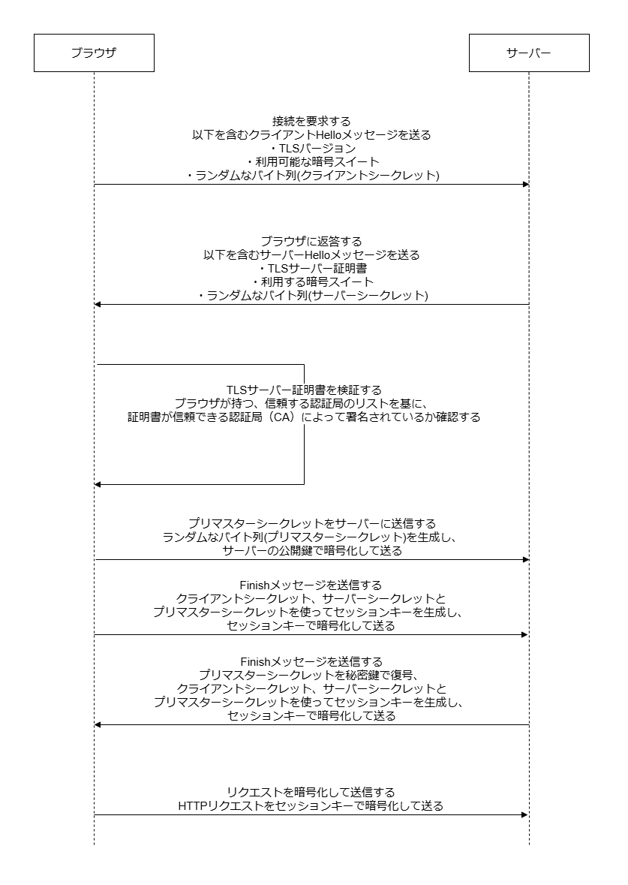

# 課題01

## 質問

### HTTPSとは

HTTPS(Hypertext Transfer Protocol Secure)は、ブラウザとサーバー間で安全にデータを送受信するための通信プロトコル。  
通常のHTTP通信にセキュリティ層を追加したもの。

### 何を暗号化するか

- URLのパスとパラメータ
- HTTPヘッダー
- リクエストボディ

#### 暗号化されないもの

- IPアドレス
- ドメイン名

### どのような危険から守るか

通信を暗号化することで以下のような危険から守る。  

- データの盗聴  
- データの改ざん
- 中間者(MITM)攻撃

サーバー認証を行うことで以下のような危険から守る。

- なりすまし
- フィッシング攻撃

### HTTPSの通信過程

### 証明書の発行元

Let’s Encryptなどの無料の証明書を発行するCA(Certificate Authority)があり、  
個人でも簡単に証明書を取得できるため、詐欺サイトでもSSL化が当たり前になっている。  
そのため信頼できるCAから発行された証明書であるかどうかを確認する必要がある。

### レスポンスヘッダー

`Strict-Transport-Security: max-age=<expire-time>`

### クッキー

`Set-Cookie: <cookie-name>=<cookie-value>; Secure; HttpOnly`

### HTTPSのときのみreferer

`Referrer-Policy: strict-origin-when-cross-origin`

## 参考

- [Cloudflare What is HTTPS?](https://www.cloudflare.com/learning/ssl/what-is-https/)
- [Cloudflare What is a session key? Session keys and TLS handshakes](https://www.cloudflare.com/learning/ssl/what-is-a-session-key/)
- [Cloudflare What happens in a TLS handshake? | SSL handshake](https://www.cloudflare.com/learning/ssl/what-happens-in-a-tls-handshake/)
- [Semrush What Is HTTPS & How Does It Work?](https://www.semrush.com/blog/what-is-https/)
- [SSLサーバー証明書の違い](https://ssl.sakura.ad.jp/column/attestation-level/)
- [詐欺サイトもSSL化が当たり前？！フィッシング詐欺被害を回避する4つの対策とは？](https://ssl.sakura.ad.jp/column/phishing/)
- [Mozilla Strict-Transport-Security](https://developer.mozilla.org/en-US/docs/Web/HTTP/Headers/Strict-Transport-Security)
- [Mozilla Set-Cookie](https://developer.mozilla.org/en-US/docs/Web/HTTP/Headers/Set-Cookie)
- [Mozilla Referrer-Policy](https://developer.mozilla.org/en-US/docs/Web/HTTP/Headers/Referrer-Policy)
