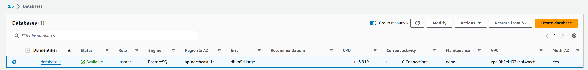
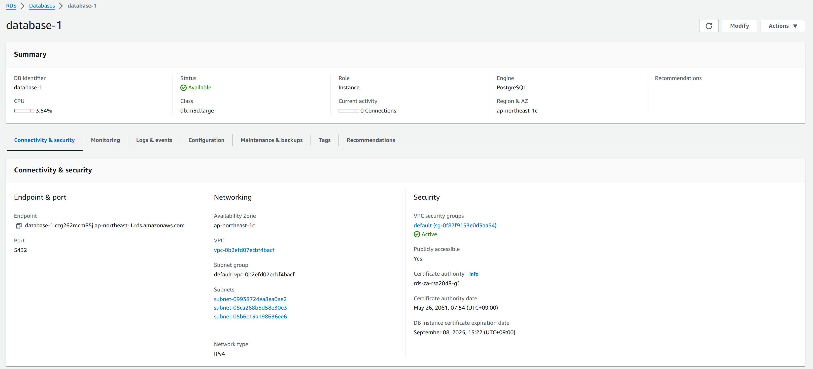
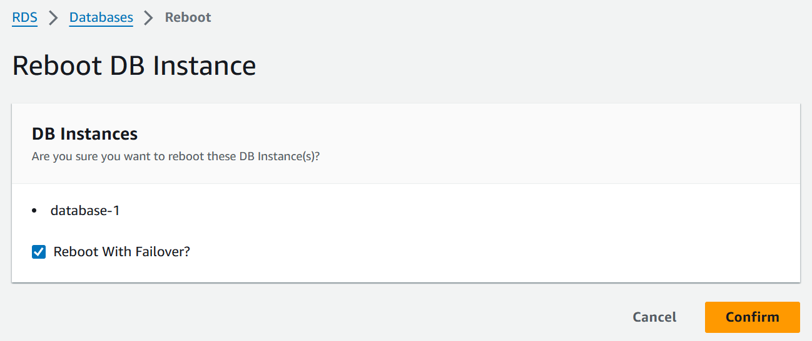
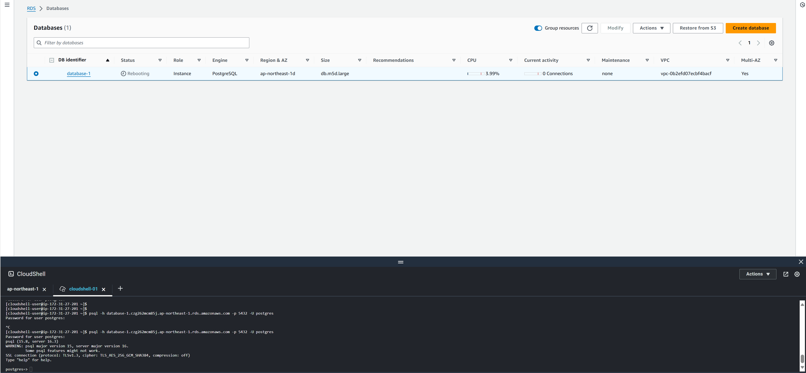

# 課題01

## RDS

### RDSの構築




### フェイルオーバー

```sh
aws rds reboot-db-instance --db-instance-identifier database-1 --force-failover
```



#### アクセス

アクセス可能

```sh
psql -h database-1.czg262mcm85j.ap-northeast-1.rds.amazonaws.com -p 5432 -U postgres
```



#### サブネット

変わる

```sh
host database-1.czg262mcm85j.ap-northeast-1.rds.amazonaws.com
```

```sh
database-1.czg262mcm85j.ap-northeast-1.rds.amazonaws.com is an alias for ec2-57-181-242-42.ap-northeast-1.compute.amazonaws.com.
ec2-57-181-242-42.ap-northeast-1.compute.amazonaws.com has address 57.181.242.42
```

再起動後

```sh
database-1.czg262mcm85j.ap-northeast-1.rds.amazonaws.com is an alias for ec2-54-250-176-89.ap-northeast-1.compute.amazonaws.com.
ec2-54-250-176-89.ap-northeast-1.compute.amazonaws.com has address 54.250.176.89
```

### 参考

- [AWS DB インスタンスの再起動](https://docs.aws.amazon.com/ja_jp/AmazonRDS/latest/UserGuide/USER_RebootInstance.html)
