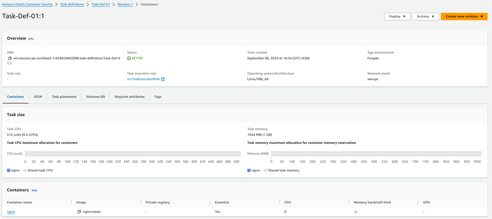
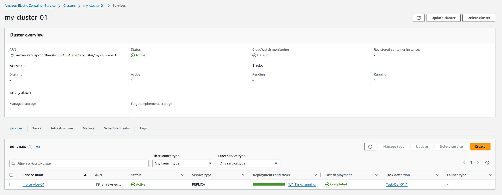
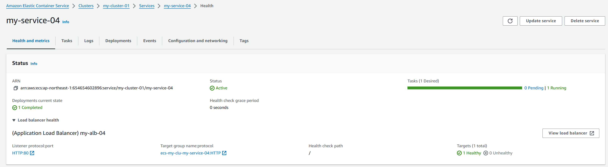
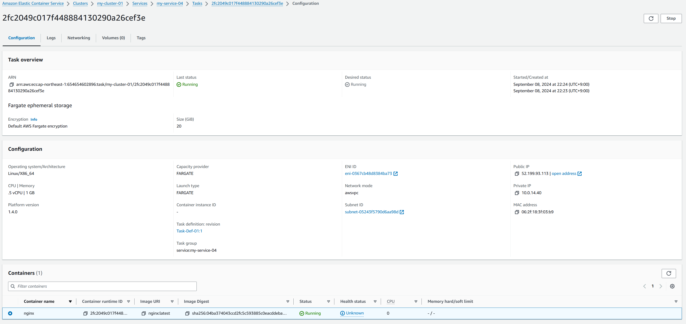
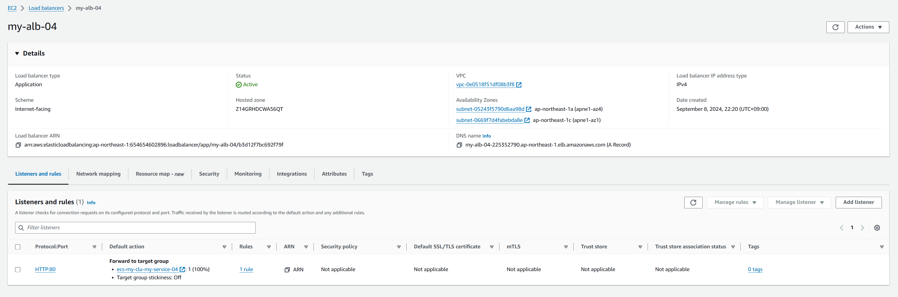
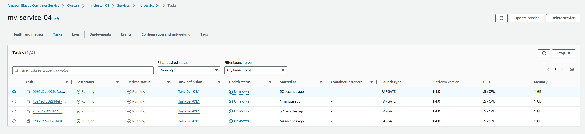

# 課題

## Fargate

### サーバーレスとは

インフラストラクチャの管理が不要であること。  
ユーザーはサーバーを管理せずアプリケーションを実行できる。  
AWSが自動的にインフラを管理し、必要なリソースを提供する。  

### 用語

#### クラスタ

複数のサービス、タスクをまとめる集まり。  
特定のVPCに関連付けられる。

#### サービス

タスクを実行・管理する。  
指定したタスク数を自動的に維持・管理する。

#### タスク

実際に実行される1つ以上のコンテナの集まり。  
タスク定義に基づいてコンテナを起動する。

### デプロイ

#### タスク定義



#### クラスタの作成



#### サービスの作成



#### タスクの作成



#### ALBの作成



```sh
curl -I http://my-alb-04-225352790.ap-northeast-1.elb.amazonaws.com
```

```sh
HTTP/1.1 200 OK
Date: Sun, 08 Sep 2024 13:49:28 GMT
Content-Type: text/html
Content-Length: 615
Connection: keep-alive
Server: nginx/1.27.1
Last-Modified: Mon, 12 Aug 2024 14:21:01 GMT
ETag: "66ba1a4d-267"
Accept-Ranges: bytes
```

### 負荷テスト

| 指標 | テスト1 | テスト2 | テスト3 |
|------|---------|---------|---------|
| リクエスト数 | 10,000 | 100,000 | 1,000,000 |
| 同時接続数 | 100 | 1,000 | 1,000 |
| 総実行時間 (秒) | 5.833 | 64.922 | 148.379 |
| 1秒あたりのリクエスト数 | 1,714.24 | 1,540.31 | 6,739.51 |
| リクエストあたりの平均時間 (ms) | 58.335 | 649.218 | 148.379 |
| 転送速度 (KB/秒) | 1,427.98 | 1,283.09 | 5,614.06 |

### タスク数の変更



| 指標 | テスト1 | テスト2 | テスト3 |
|------|---------|---------|---------|
| リクエスト数 | 10,000 | 100,000 | 1,000,000 |
| 同時接続数 | 100 | 1,000 | 1,000 |
| テスト実行時間 (秒) | 4.277 | 63.940 | 113.077 |
| 秒間リクエスト数 (平均) | 2,338.35 | 1,563.96 | 8,843.54 |
| リクエストあたりの時間 (ms, 平均) | 42.765 | 639.403 | 113.077 |
| 転送速度 (KB/秒) | 1,947.87 | 1,302.79 | 7,366.74 |
