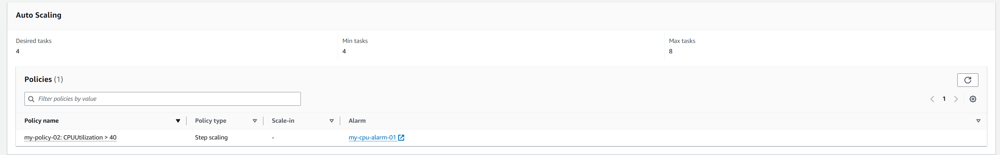
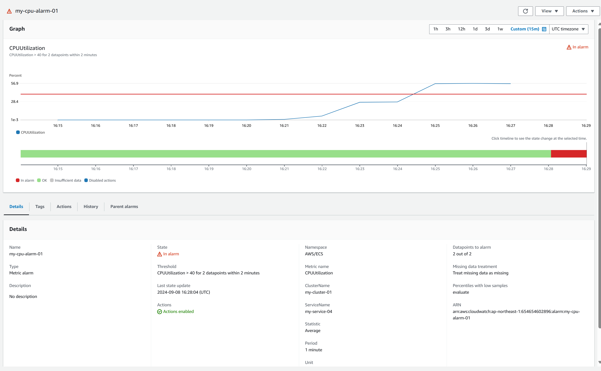
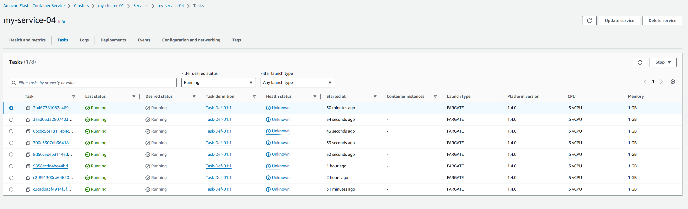
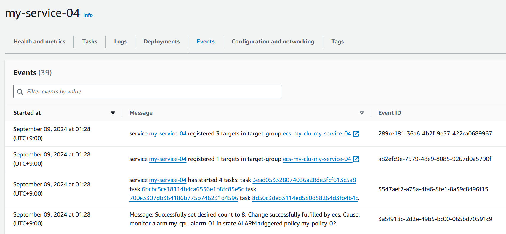
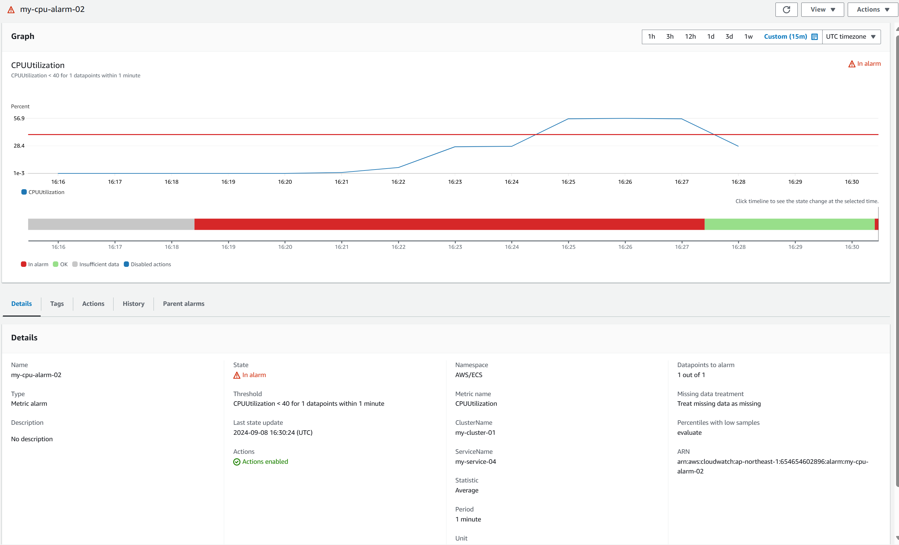
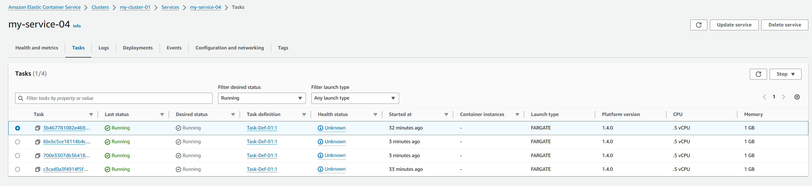
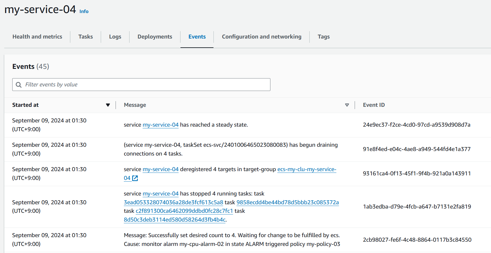

# 課題

## Auto Scaling

### ECS サービスに Auto Scaling を設定



```sh
ab -k -n 10000000 -c 1500 http://my-alb-04-225352790.ap-northeast-1.elb.amazonaws.com/
```

### スケールアウト

アラート



タスク数



イベント



### スケールイン

アラート



タスク数



イベント


