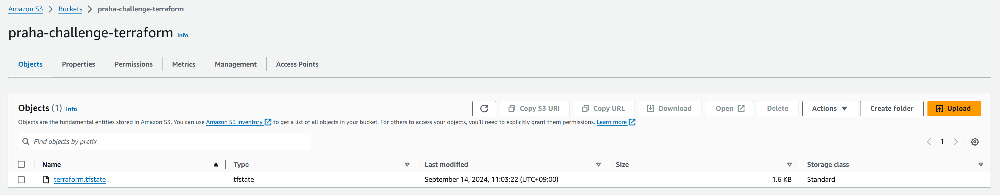

# 課題

## Terraform

### インストール

インストール

```sh
wget -O- https://apt.releases.hashicorp.com/gpg | sudo gpg --dearmor -o /usr/share/keyrings/hashicorp-archive-keyring.gpg
echo "deb [signed-by=/usr/share/keyrings/hashicorp-archive-keyring.gpg] https://apt.releases.hashicorp.com $(lsb_release -cs) main" | sudo tee /etc/apt/sources.list.d/hashicorp.list
sudo apt update && sudo apt install terraform
```

確認

```sh
terraform -v
```

```sh
Terraform v1.9.5
on linux_amd64
```

### S3にStateを保存



### 参考

- [Terraform](https://developer.hashicorp.com/terraform)
- [Terraform ベストプラクティスを整理してみました。](https://dev.classmethod.jp/articles/terraform-bset-practice-jp/)
- [Terraform Backend S3](https://developer.hashicorp.com/terraform/language/backend/s3)
- ECS
  - [Create and manage an AWS ECS cluster with Terraform](https://www.architect.io/blog/2021-03-30/create-and-manage-an-aws-ecs-cluster-with-terraform/)
  - [Create an AWS ECS Cluster Using Terraform](https://dev.to/thnery/create-an-aws-ecs-cluster-using-terraform-g80)
  - [ECS/FargateでAuto Scalingの設定をしてみた](https://blog.adachin.me/archives/47303)
